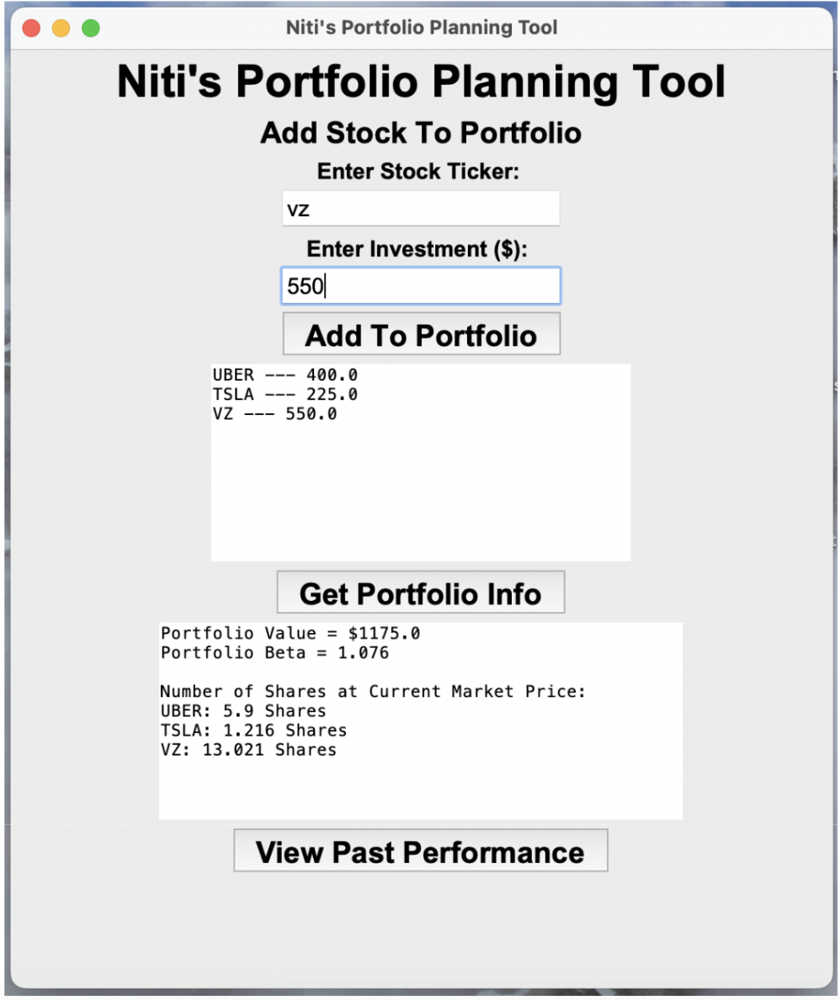
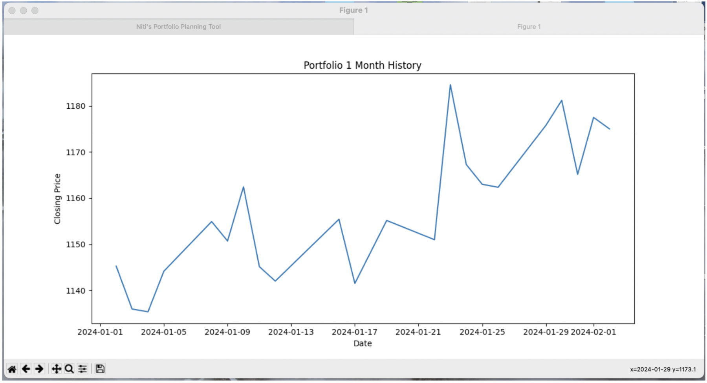

# Niti's Portfolio Planning Tool
## Description
This is a GUI-based tool that allows users to add securities to a portfolio, calculate the portfolio beta and number of shares, and view a graph of the trailing 30-day performance.

## Prerequisites
Before running the program, make sure you have the following dependencies installed:

- tkinter
- yfinance
- matplotlib.pyplot
- pandas

You can install these dependencies using the following:
 
```shell
pip install tkinter
pip install yfinance
pip install matplotlib
pip install pandas
```

 Clone the repository to your local machine:

```shell
git clone https://github.com/niti-go/Niti-Portfolio-Planning-Tool.git
```

Launch the application, and the GUI window will appear.
## Instructions
### Adding an Investment:
- Enter the stock ticker.
- Enter the corresponding investment amount.
- Click the "Add to Portfolio" button.

As investments are added, they will appear in the box. You can then proceed to receive information about the portfolio.

### Getting Portfolio Information

- Click the "Get Portfolio Info" button.

This will provide real-time information about the total portfolio value, portfolio beta, and number of shares  in the portfolio at the current market price.

### View 30-Day Trailing Performance
- Click the "View Past Performance" button.

A separate window will display a graph generated from the previous 30 days' closing prices of the individual stocks in the portfolio. 
The data for each stock is scaled by the number of shares held, and the graph represents the sum of these scaled points.

## Demo


